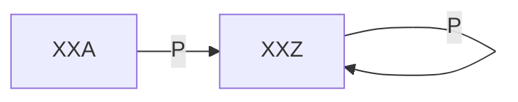

# Advent of code challenge 2023, in GO, day d08

The part 2 is one of these problems where the problem text is not solvable in reasonable time, but by examining the input, we can see it has very specific properties that enable to use an ad hoc, very simplified solution.

Here, in the input, the ghost each go through only one Z-ended node, looping with a fixed loop of period P, that coincidentally also starts at zero. Thus solution is thus trivial: the least common multiplicator (aka "LCM") of all the ghost loop periods.

My code checks that the input is in this special case and applies the LCM shortcut, or otherwise fall back to the general solution.
